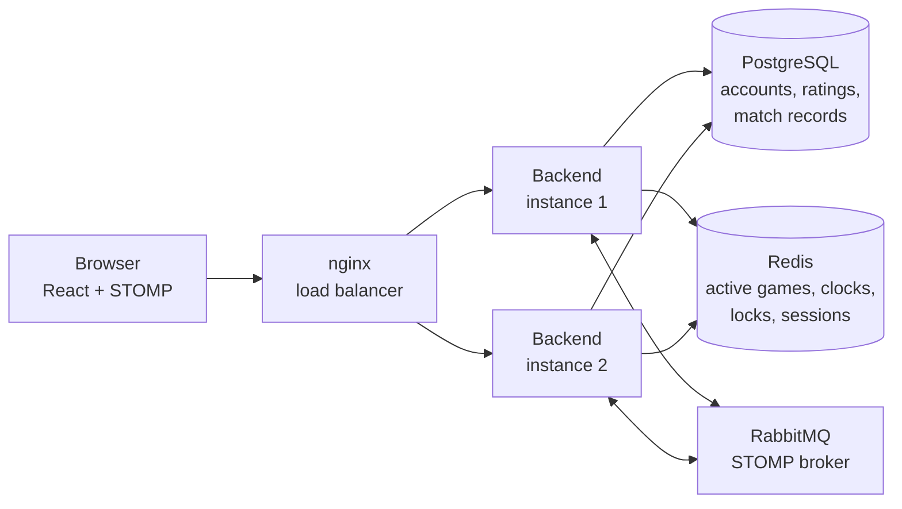

# Chess Platform

[](https://github.com/zilid10/chess-platform/actions/workflows/ci.yml)
[](LICENSE)


A real-time multiplayer chess platform with a chess engine written from scratch, live clocks, Elo ratings, and a
backend that scales horizontally: any number of instances can serve the same game.

Players create a game on a clock such as `5+3`, share its ID, and play over WebSockets. Others who open the same game
watch it live and can chat. Finished games are rated, archived with their PGN, and listed in each player's history.

---

## Features

**Play**

- Real-time games over STOMP WebSockets, with spectators and in-game chat
- Eleven clock settings, from `1+0` bullet to `30+20` classical, with increments
- Games end on time even if a player disconnects: the server runs the clocks, not the browser
- Unstarted games are aborted: White has 30 seconds to make a first move, then Black has 30 seconds to reply
- Resignation, draw offers, and every standard ending: checkmate, stalemate, threefold repetition, the fifty-move rule,
  insufficient material, and a draw when time runs out but the opponent could never checkmate

**Compete**

- Separate Elo ratings for bullet, blitz, rapid, and classical, starting at 1200
- A K-factor that settles as players gain experience: 40 for a player's first 20 games, then 20 up to a 2100 rating,
  then 10
- Game history with rating changes, and PGN you can download or copy

**Connect**

- Accounts with profiles, and friend requests you can send, accept, or reject
- Session login shared across every backend instance

---

## Highlights

### A chess engine built from scratch

The rules engine in `backend/.../chess/` has no framework dependencies. It includes:

- legal move generation, with check detection, castling through unattacked squares, en passant, and promotion to any
  piece;
- move application with full undo;
- FEN and UCI parsing, and SAN and PGN output with file, rank, and square disambiguation.

A perft suite counts every legal move sequence from standard test positions and compares the totals with published
references, such as 197,281 positions at depth 4 from the starting position. That catches bugs in how castling,
en passant, promotion, and check interact.

### Clocks the server can enforce

Each player's clock deadline is indexed in a Redis sorted set. A sweeper checks it every 250 ms and ends overdue games,
so a player who disconnects still loses on time. Each game is updated under a per-game Redis lock, so when several
instances notice the same timeout, only one ends the game, publishes the result, and archives the match. Clients can
also claim a flag the moment a clock hits zero, but the server decides using its own clock.

### Horizontal scaling

Nothing about a game lives in one instance's memory:

- **Active games** are stored in Redis and changed under per-game locks, so concurrent moves are serialized across
  instances.
- **Login sessions** are stored in Redis with Spring Session.
- **WebSocket subscriptions** live in RabbitMQ through Spring's STOMP broker relay. A move handled by one instance
  reaches players connected to another, including private `/user/...` messages.

Docker Compose runs two backend instances behind nginx by default.



---

## Tech Stack

| Area           | Technologies                                                                                           |
|----------------|--------------------------------------------------------------------------------------------------------|
| Backend        | Java 21 (virtual threads), Spring Boot 4.1, Spring Security, Spring WebSocket (STOMP), Spring Data JPA |
| Data           | PostgreSQL 17.5 with Flyway migrations, Redis 8.6 with Spring Session                                  |
| Messaging      | RabbitMQ 4.1 as an external STOMP broker                                                               |
| Frontend       | React 18, TypeScript, Vite, Tailwind CSS, react-chessboard, chess.js, STOMP.js                         |
| Quality        | JUnit, Mockito, Testcontainers, JSpecify with NullAway, Vitest, ESLint                                 |
| Infrastructure | Docker Compose, nginx, GitHub Actions                                                                  |

---

## Getting Started

### Run with Docker Compose

You need Docker and Docker Compose. These ports must be free: 3000, 8080, 5432, 6379, 61613, and 15672.

```bash
docker compose up --build
```

Compose starts PostgreSQL, Redis, and RabbitMQ, applies the database migrations, then starts two backend instances
behind nginx and the frontend. To run more or fewer instances, change `deploy.replicas` under `backend` in
`docker-compose.yml`, then restart `backend-lb` so nginx sees them.

| Service                         | URL                                           |
|---------------------------------|-----------------------------------------------|
| Frontend                        | http://localhost:3000                         |
| REST API                        | http://localhost:8080/api                     |
| API documentation (dev profile) | http://localhost:8080/swagger-ui.html         |
| Health check                    | http://localhost:8080/actuator/health         |
| RabbitMQ management UI          | http://localhost:15672 (`chess` / `password`) |

To try a game, register two accounts and sign in from two browsers, or from a normal and a private window. Create a
game on one, then join it from the other with the game ID.

The credentials in `docker-compose.yml` are for local development only.

### Run without Docker Compose

1. Start PostgreSQL on port 5432 and Redis on port 6379, and create a database and user. A single backend instance
   doesn't need RabbitMQ: it uses Spring's in-memory broker unless `APP_WEBSOCKET_RELAY_ENABLED=true`.
2. From `backend/`, set `flyway.url`, `flyway.user`, and `flyway.password` in `flyway.conf`, then apply the migrations:

   ```bash
   flyway -configFiles=flyway.conf migrate
   ```

3. From `backend/`, start the backend with JDK 21:

   ```bash
   export SPRING_DATASOURCE_URL=jdbc:postgresql://localhost:5432/your_db
   export SPRING_DATASOURCE_USERNAME=your_db_user
   export SPRING_DATASOURCE_PASSWORD=your_db_password
   export SPRING_DATA_REDIS_HOST=localhost
   ./mvnw spring-boot:run
   ```

4. In `frontend/vite.config.ts`, change both proxy targets from `http://backend-lb:8080` to `http://localhost:8080`.
   Then, from `frontend/`:

   ```bash
   npm ci
   npm run dev
   ```

### Configuration

| Variable                                                   | Purpose                                                                                    |
|------------------------------------------------------------|--------------------------------------------------------------------------------------------|
| `SPRING_PROFILES_ACTIVE`                                   | `dev` (default) or `prod`. `prod` hides the API documentation and most actuator endpoints. |
| `SPRING_DATASOURCE_URL`, `_USERNAME`, `_PASSWORD`          | PostgreSQL connection                                                                      |
| `SPRING_DATA_REDIS_HOST`, `_PORT`                          | Redis connection                                                                           |
| `APP_ALLOWED_ORIGINS`                                      | Comma-separated frontend origins allowed for HTTP and WebSocket requests                   |
| `APP_WEBSOCKET_RELAY_ENABLED`                              | Route WebSocket messages through RabbitMQ. Required when running more than one instance.   |
| `APP_WEBSOCKET_RELAY_HOST`, `_PORT`, `_LOGIN`, `_PASSCODE` | RabbitMQ STOMP connection                                                                  |

---

## Testing

From `backend/`:

```bash
./mvnw test     # unit tests, no Docker needed
./mvnw verify   # also runs the integration tests
```

Integration tests (`*IT`) start PostgreSQL, Redis, and RabbitMQ with Testcontainers and apply the migrations with
Flyway, so they only need a running Docker daemon. `WebSocketRelayIT` starts two backend instances against one RabbitMQ
and checks that a move made on one reaches a player connected to the other.

```properties
docker.host=unix:///Users/<you>/.orbstack/run/docker.sock
```

From `frontend/`:

```bash
npm ci
npm run lint
npm test
npm run build   # includes the TypeScript check
```

GitHub Actions runs all of these on every push and pull request.

---

## API Overview

REST endpoints live under `/api`. With the dev profile, the full reference is at `/swagger-ui.html`.

| Area                | Endpoints                                                                                                                                                                                                  |
|---------------------|------------------------------------------------------------------------------------------------------------------------------------------------------------------------------------------------------------|
| Accounts            | `POST /users` (register), `POST /login`, `GET /me`, `GET` / `PUT` / `DELETE /users`                                                                                                                        |
| Games               | `POST /games`, `POST /games/{gameId}/join`, `GET /games/{gameId}/state`, `GET /games/{gameId}/pgn`                                                                                                         |
| History and ratings | `GET /games/users/{userId}`, `GET /users/{userId}/ratings`                                                                                                                                                 |
| Friends             | `GET /friends`, `GET /friends/received`, `GET /friends/sent`, `POST /friends/send/{userId}`, `POST /friends/accept/{friendRequestId}`, `PUT /friends/reject/{friendRequestId}`, `DELETE /friends/{userId}` |

The STOMP endpoint is `/ws`. Topic names use dots because RabbitMQ topic names cannot contain `/`.

| Direction | Destination                                     | Purpose                                       |
|-----------|-------------------------------------------------|-----------------------------------------------|
| Send      | `/app/game/{gameId}/join`                       | Join as a player or spectator                 |
| Send      | `/app/game/{gameId}/move`                       | Make a move, with an optional promotion piece |
| Send      | `/app/game/{gameId}/flag`                       | Claim that the opponent's clock has run out   |
| Send      | `/app/game/{gameId}/resign`                     | Resign                                        |
| Send      | `/app/game/{gameId}/draw/offer`, `/draw/accept` | Offer or accept a draw                        |
| Send      | `/app/game/{gameId}/chat`                       | Send a chat message                           |
| Subscribe | `/topic/game.{gameId}`                          | Game state, including both clocks             |
| Subscribe | `/topic/game.{gameId}.chat`                     | Chat messages                                 |
| Subscribe | `/user/topic/errors`                            | Errors for your own actions                   |

---

## Project Structure

```text
chess-platform/
├── backend/                    # Spring Boot application (Maven wrapper, Dockerfile, flyway.conf)
│   └── src/main/
│       ├── java/me/zilid/chessplatform/
│       │   ├── chess/          # Rules engine: board, move generation, game lifecycle, clocks, FEN/UCI/PGN
│       │   ├── rating/         # Rating contracts and the Elo implementation
│       │   ├── controller/     # REST and STOMP entry points, and error translation
│       │   ├── service/        # Use cases and transaction boundaries
│       │   ├── repository/     # PostgreSQL access, and Redis game state, deadlines, and locks
│       │   ├── model/          # JPA entities, API DTOs, and converters
│       │   ├── security/       # Spring Security setup and the session principal
│       │   └── config/         # Infrastructure wiring, including the WebSocket broker
│       └── resources/db/migrations/   # Flyway migrations
├── frontend/                   # React app: pages/, components/, services/, types/
├── .github/                    # CI workflow, Dependabot, and issue and PR templates
└── docker-compose.yml          # Full local stack
```

### Architecture notes

- Dependencies point one way: `controller -> service -> repository`. The `chess` and `rating` packages are
  independent of Spring, persistence, and security. Controllers pass `Player` values or user IDs into services, not
  Spring Security principals.
- Each backend package documents its responsibility in `package-info.java` and is `@NullMarked`. NullAway checks
  nullness at compile time.
- Spring Boot does not run Flyway at startup. Docker Compose applies migrations with the Flyway container, and tests
  apply them with Flyway.
- `security.UserPrincipal` is stored in Redis sessions with Java serialization. Changing its class name, fields, or
  `serialVersionUID` invalidates existing sessions, so flush the Spring Session keys in Redis when deploying such a
  change.

---

## Roadmap

- Choose the promotion piece in the UI. The engine and API already support any piece; the board promotes to a queen.
- Matchmaking by rating
- Glicko-2 ratings
- Game analysis and an AI opponent with Stockfish
- Opening book
- Tournaments

---

## License

[MIT](LICENSE) © 2026 zilid10
